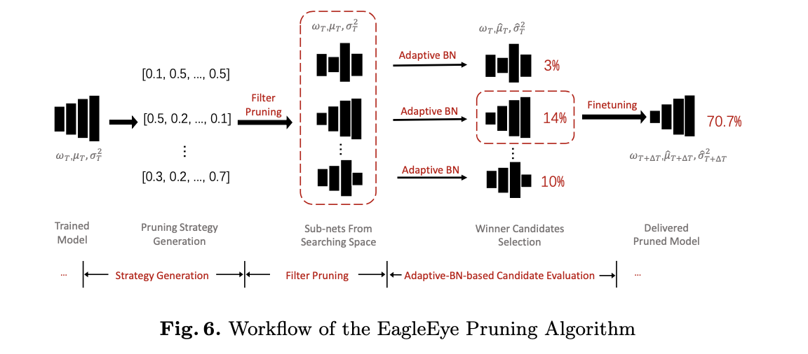

前提:
DNN的过参数化

prunning 优点:
1. 占的内存少
2. 运行时计算量少

核心问题是成如何有效地裁剪模型且最小化精度的损失

##基于度量标准的剪枝
通常是提出一个判断神经元是否重要的标准，依据这个标准将不重要的神经元剪掉。主要分为三大块 weight/activation/gradient

### Weight:

1.[Filter Pruning via Geometric Median
for Deep Convolutional Neural Networks Acceleration](https://arxiv.org/pdf/1811.00250.pdf)

去除相似的kernel
Filter Pruning via Geometric Median

reference:
Robust statistics on riemannian manifolds via the geometric median

### Actviation

1.[Network Trimming: A Data-Driven Neuron Pruning Approach towards Efficient Deep Architectures](https://arxiv.org/pdf/1607.03250.pdf)
用activations中0的比例 (Average Percentage of Zeros, APoZ)作为度量标准

reference:
Learning both weights and connections for efficient neural networks

2.[An Entropy-based Pruning Method for CNN Compression](https://arxiv.org/pdf/1706.05791.pdf)
用全局平均池化来转化一个layer的output，得到一个向量。用验证集的一些图片进入网络，就可以得到一个矩阵，这个filter的熵就可以用这个矩阵计算出来。然后排序删除

reference:
Binarized neural networks: Training deep neural
networks with weights and activations constrained to +1 or
-1

### Gradient

[Pruning Convolutional Neural Networks For Resource Efficient Inference](https://arxiv.org/pdf/1611.06440.pdf)
将prune filter看作一个优化问题。反向传播代价函数以泰勒展开作为准则决定prune 哪些filters。

##基于重建误差的剪枝
这类方法通过最小化特征输出的重建误差来确定哪些filters要进行剪裁，即找到当前层对后面的网络层输出没啥影响的信息。

1.[NISP: Pruning Networks using Neuron Importance Score Propagation](https://arxiv.org/pdf/1711.05908.pdf)通过最小化网络倒数第二层的重建误差，并将反向传播的误差累积考虑在内，来决定前面哪些filters需要裁剪。

##基于稀疏训练的剪枝

1.[Synaptic Strength For Convolutional Neural Network](https://arxiv.org/pdf/1811.02454.pdf)
基于连接强度修剪。【smaller-norm-less-important】

reference:
[Pruning filters for efficient convnets](https://arxiv.org/pdf/1608.08710.pdf)

## NAS
1[Approximated Oracle Filter Pruning for Destructive CNN Width Optimization](https://arxiv.org/abs/1905.04748)行操作网络的所有层，用二分搜索的方式确定每层的剪枝数。用下一层的输出featuremap的变化程度，而非最终的输出来评估删掉一个filter的影响。

2.[DSA: More Efficient Budgeted Pruning via Differentiable Sparsity Allocation](https://arxiv.org/abs/2004.02164)
在结构化剪枝情况下 对budge训练使得acc可微。

## GAN
[Towards Optimal Structured CNN Pruning via Generative Adversarial Learning](https://arxiv.org/pdf/1903.09291.pdf)

1. 第一个阶段固定生成器和掩膜，通过对抗训练更新判别器D，损失函数包含对抗损失与对抗正则项；
2. 第二阶段固定判决器，更新生成器与掩膜，损失函数包含对抗损失中的生成器与baseline特征输出的MSE损失以及生成器和掩膜的正则项。

##评估
1\. EagleEye: Fast Sub-net Evaluation for Efficient Neural Network Pruning [Bailin Li1, Bowen Wu2, Jiang Su1, Guangrun Wang2, and Liang Lin1,2]

采用自适应批归一化技术进行修剪, 将相关性分析引入修剪算法领域的。

Reference:

Revisiting batch normalization for practical domain adaptation.

